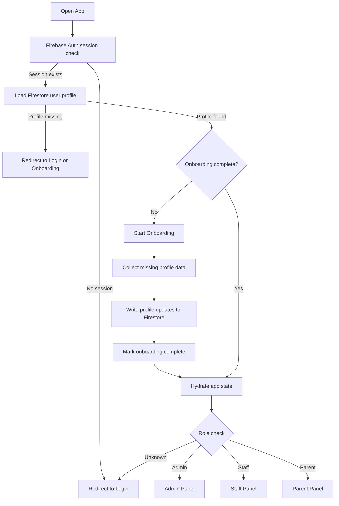

# Authentication and Onboarding Flow

This project uses a standard authentication and onboarding pipeline with a hybrid state management model:

- Firebase Auth owns identity, session persistence, and sign-in status.
- Firestore owns application profile state, role data, onboarding completion, and domain-specific permissions.

## Flow Overview



## State Responsibilities

### Firebase Auth

Firebase Auth should be the source of truth for:

- login and logout
- password verification
- session persistence across reloads
- current user UID

### Firestore

Firestore should be the source of truth for:

- user profile document keyed by UID
- role and sub-role
- onboarding progress
- account status
- organization membership and branding data

## Recommended Sequence

1. Authenticate with Firebase Auth.
2. Read the user profile from Firestore using the Firebase UID.
3. If the profile does not exist, route the user into onboarding or block access.
4. If onboarding is incomplete, collect the missing fields and persist them to Firestore.
5. Mark onboarding complete in Firestore.
6. Hydrate the UI from the Firestore profile and render the correct dashboard by role.

## Practical Routing Rules

- Firebase Auth session exists, but no Firestore profile: user is not ready for the app.
- Firestore profile exists, but onboarding is incomplete: send user to onboarding.
- Firestore profile exists and onboarding is complete: send user to the role-based dashboard.
- Any role mismatch or deleted account: sign the user out and return to login.

## Why This Hybrid Model Works

- Firebase Auth keeps authentication reliable and secure.
- Firestore keeps the app flexible for profile expansion and onboarding state.
- The UI can load fast from the auth session while still waiting on profile data.
- Role-based access stays decoupled from identity, which makes admin and staff flows easier to maintain.

## Suggested Data Shape

```ts
type UserProfile = {
  uid: string
  email: string
  role: "admin" | "staff" | "parent"
  onboardingComplete: boolean
  status: "active" | "pending" | "disabled"
  organizationId?: string
  createdAt: string
  updatedAt: string
}
```

## Implementation Notes

- Keep auth listeners in one place so redirects do not fight each other.
- Use Firestore for onboarding flags instead of local storage so completion survives refreshes and device changes.
- Treat local UI state as temporary and Firestore as the persistent profile source.
